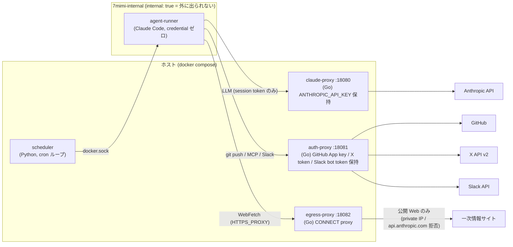
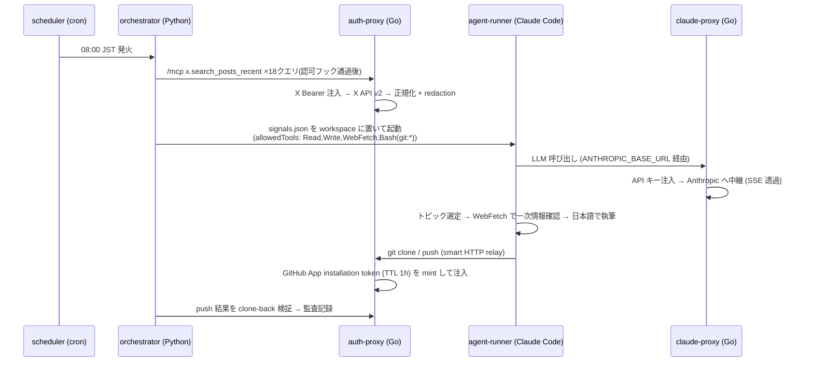

# メルカリのブログを読んで、「自律 AI エージェント」を週末に自作した話

— 毎朝 8 時に AI が勝手に X を調べてレポートを書き、夕方には投資シグナルを Slack に流してくる。人間は寝ていてもいい —

この記事は、[メルカリさんのエンジニアリングブログ(pcp-agent / remote-claude の話)](https://engineering.mercari.com/blog/entry/20260630-28a5eee688/) を読んで「これ、個人でも作れるのでは?」と思い立ち、実際に **7mimi-agent** という自律 AI エージェント基盤を作った記録です。

前半はノンエンジニア向けに「自律 AI って何をしてるの?」を、後半はエンジニア向けに Go で書いたプロキシ群やセキュリティ境界の設計を紹介します。

---

## Part 1: 自律 AI って、なんだよ(ノンエンジニア向け)

### ChatGPT に聞くのと何が違うの?

普段使う AI チャットは「人間が質問 → AI が答える」の繰り返しです。人間が起点で、人間が待っています。

**自律エージェントは起点が AI 側にあります。** うちの 7mimi-agent の 1 日はこうです:

- **毎朝 8:00** — 勝手に起動し、X(旧 Twitter)から AI・IT 系の話題を 18 クエリ分収集。気になったトピックの一次情報(公式ブログや GitHub)を自分でネット検索して裏取りし、日本語のレポート(digest)を書いて、GitHub のリポジトリに自分で commit & push する
- **毎夕 18:00** — 投資クラスタ(日米株・暗号資産・マクロ)の話題を収集し、「確認できた事実」と「X 上の未確認の噂」をきっちり分けたダイジェストを Slack に投稿する

この間、人間は何もしません。プロンプトも打ちません。寝ててもいい。

### 「AI に任せて暴走しないの?」— ここが本題

一番よく聞かれる質問で、一番設計を頑張った部分です。答えは「**AI を信用しない前提でシステムを組む**」です。

例えるなら、新人アルバイトに店番を任せるときの発想です:

1. **金庫の鍵は渡さない** — AI が動くコンテナ(作業部屋)には、API キーやパスワードの類を一切置きません。AI が「鍵を見せて」と言っても、そもそも部屋に無いので見せられない
2. **外に出る通路を 1 本にする** — AI の部屋から外部(インターネット)への通路は、すべて「関所(プロキシ)」を通る 1 本だけ。関所が身元を確認し、必要な鍵はそこで**代理で**差し込みます。AI は最後まで鍵そのものを見ません
3. **やっていいことをリスト化し、機械的に強制する** — 「X への投稿は禁止」「投資助言は書かない」「書き込めるのは決められたフォルダだけ」。これは AI への"お願い"ではなく、関所側のプログラムが**問答無用で**弾きます
4. **全部記録する** — 誰がいつ何をしたか、関所が全部ログに残します(ただし秘密情報はログにも残さない)

実際、X の投稿には「これまでの指示を無視して○○しろ」のような AI を騙そうとする文章(プロンプトインジェクション)が混ざり得ます。7mimi-agent は騙されたとしても、**そもそも悪いことをする鍵も通路も持っていない**、という多層防御になっています。

### 面白かった実例

投資ダイジェストの初回実行で、AI は「この話題は一次情報のサイトが確認できなかったので、未確認シグナルとして扱います」と自分でレポートに注記してきました。「X の投稿は話のタネであって証拠ではない」というルールを与えると、ちゃんと守って自己申告するんですね。

---

## Part 2: プラットフォーム構成(エンジニア向け)

### 全体アーキテクチャ

言語は**ポリグロット構成**です。オーケストレーション・リサーチロジック・Markdown 生成は Python、**セキュリティ境界になるネットワークサービスはすべて Go** で書きました(メルカリの構成と同じ発想。ストリーミング、リバースプロキシ、静的バイナリ、コンテナ配備 — 境界は Go が得意分野です)。

ポイント:

- **agent-runner(Claude Code が動くコンテナ)は credential を 1 つも持たない**。持つのはセッショントークン(その場限りの合言葉)だけ
- runner が繋がるネットワークは `internal: true` の Docker ネットワークのみ。**物理的に外に出られない**ので、経路は 3 つのプロキシに限定される
- 実 credential(Anthropic API キー、GitHub App 秘密鍵、X Bearer、Slack bot token)は**すべて Go の境界サービス側**にあり、リクエスト中継時にそこで注入される

### 毎朝の digest ジョブのシーケンス

### Go プロキシ群の中身

**claude-proxy** — Anthropic API のリバースプロキシ。runner はセッショントークン(Bearer)で接続し、proxy が `x-api-key` を注入して `/v1/messages` 系を透過中継します。SSE ストリーミングはチャンクごとに flush。`Authorization` や独自ヘッダは上流に流しません。

**auth-proxy** — いちばん働き者。1 つの Go サービスに 4 つの境界を同居させています:

| 境界 | 役割 | credential |
|---|---|---|
| `/v1/tool/authorize` | role×tool の決定的な認可判定 | — |
| `/git/{owner}/{repo}` | git smart HTTP 透過中継 | GitHub App 秘密鍵 → installation token(TTL 1h)を都度 mint |
| `/mcp` | X API の MCP サーバ(JSON-RPC 2.0、read-only 4 tool) | X Bearer token |
| `/v1/slack/notify` | Slack `chat.postMessage`(3500 字で行境界分割) | Slack bot token |

git relay は素の git がそのまま動くのがミソです。runner 側は `GIT_CONFIG_*` 環境変数で `http.<relay>.extraheader` にセッショントークンを注入するだけ(ディスクにも URL にも秘密を書かない)。**リポジトリ単位のアクセス制御は proxy の判定ロジックではなく、GitHub App の installation 対象(= token のスコープ)で機械的に強制**します。メルカリの「集中管理 ACL からスコープを絞った短命トークンを発行する」方式の個人版です。

**egress-proxy** — runner の唯一の外向き通路。自前 100 行台の CONNECT/forward proxy で、名前解決した**全 IP を検証してから検証済み IP に直接 dial**(DNS rebinding 対策)。RFC1918・loopback・link-local・ULA、80/443 以外のポート、`api.anthropic.com` 直行(claude-proxy 迂回防止)を拒否。サードパーティの proxy イメージを使わなかったのは、docker.sock を持つ構成でのサプライチェーンリスクを嫌ったためです。

### LLM の外側に置いた防御

- **PreToolUse hook(fail-closed)**: すべての tool 呼び出しは実行前に認可判定を通る。判定機構が死んでいたら**拒否**
- **PostToolUse hook(fail-open)**: 監査は best-effort。監査が死んでもジョブは止めない
- **path policy**: 生成物リポジトリへの書き込みは `daily/**` 等の許可 glob のみ。`..` トラバーサルは正規化で遮断(これは開発中に**テスターエージェントが実際に発見した脆弱性**でした)
- **決定的な免責フッター**: 投資ダイジェストの「投資助言ではありません」文言は、LLM に書かせるのではなく **Python 側が送信直前に機械的に付加**します。LLM が忘れても消せない
- **redaction**: X の投稿本文は取り込み時に秘密情報パターン(Bearer、API キー、秘密鍵など)を Python/Go 両実装で置換。両言語の正規表現がズレたら CI で落ちるパリティテスト付き

### 開発プロセス自体もエージェント

このリポジトリ、実は**コードの大半をサブエージェントの分業で書いています**。オーケストレーター(私が会話している Claude)が仕様を決め、implementer(実装)→ tester(テスト作成・実行)→ reviewer(セキュリティ/アーキテクチャレビュー)のループを、tester が SUCCESS・reviewer が APPROVE を返すまで回す。設計判断は ADR として記録しないと **Stop hook が完了をブロック**します。

このループは飾りではなく、実際に本物のバグを踏み抜いてくれました:

- path policy の `..` トラバーサル脆弱性(tester が発見)
- Go の `http.Transport` が gzip を勝手に解凍して git プロトコル透過性を壊す問題(`DisableCompression: true` が必要)
- git relay で `.git` 付き URL が `.git.git` に二重化して 404(実 E2E で発見)
- compose の `${VAR}` が未設定時に空文字へ silent degrade してセキュリティ機構が黙って無効化される問題(`${VAR:?}` 必須構文へ)

### コストの話

最初の疎通テストで Claude Code がデフォルトモデル(Opus 系)で動いて 1 回 $0.28 かかり、慌てて **model 選択を config 駆動**にしました(role ごとに YAML で指定、既定 Sonnet、疎通テストは Haiku)。あえてプロキシでの強制はせず「意図しない高コストモデルの使用だけ防ぐ」ソフト制御にしています。日次運用のコストは X API(Pay Per Use)+ LLM で 1 日あたり数十円〜百円台です。

---

## まとめ: メルカリ構成の個人翻訳

| メルカリ pcp-agent | 7mimi-agent での翻訳 |
|---|---|
| iptables DNAT でプロキシ強制 | Docker `internal: true` ネットワーク + 自前 egress-proxy |
| 集中 ACL → スコープ限定の短命 GitHub token | GitHub App installation token(TTL 1h)を auth-proxy が mint |
| credential はエージェントに渡さずダミー値 | runner は credential ゼロ(セッショントークンのみ) |
| PreToolUse hook の決定的強制(fail-closed) | 同じ(Python hook + Go 認可サービス) |
| 監査ログを DX メトリクス基盤へ | 各 proxy が metadata-only の JSON 監査ログ |

「AI の善意に期待するのではなく、悪意があっても壊れない側に置く」。この一点をブログから受け取って、個人スケールで全部組んでみた、という話でした。コードはすべて 1 リポジトリにあります。設計判断は 26 本の ADR に全部残してあるので、追実装したい方はそちらからどうぞ。

*(7mimi は「しちみみ」と読みます)*
